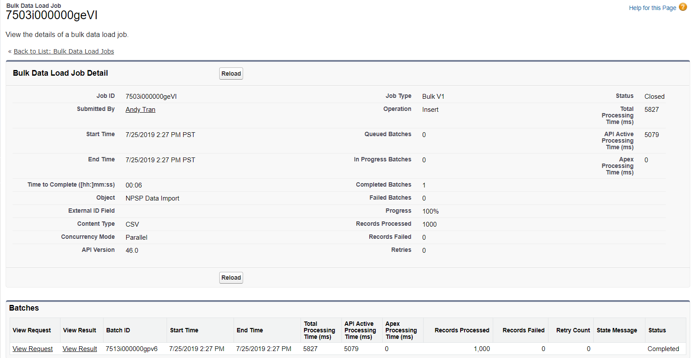
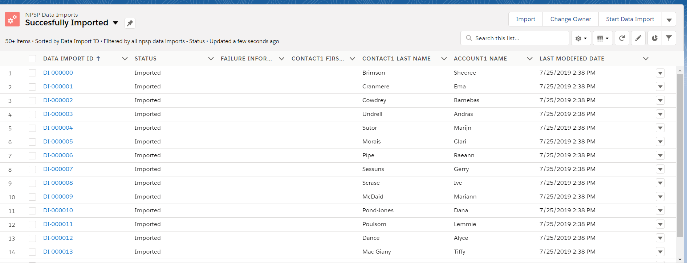
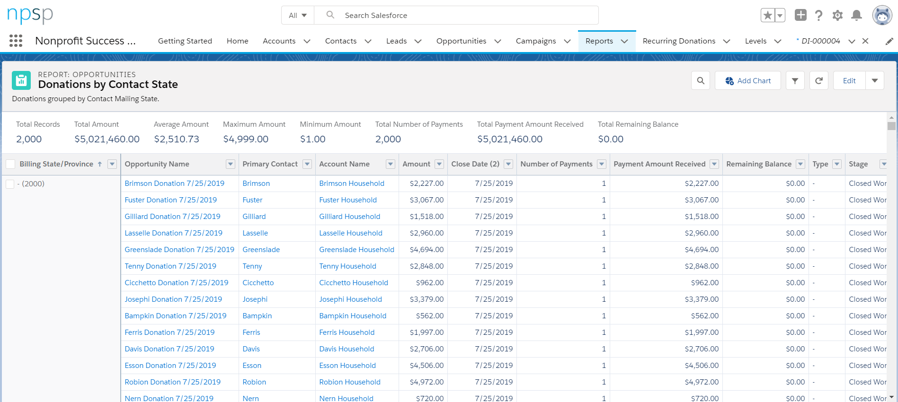

# Salesforce Assignment

## Objective
- To successfully import a dataset into Salesforce

## My Approach
1. For the purpose of this assignment I created a dataset through Mockaroo with five columns and 2000 observations. This dataset consisted of First Name, Last Name, City, Donation Amount, and Emails

2. Imported data into Salesforce NPSP. I utilized the NSPS Data Importer tool to do this.

3. Add new records, set correct character code, and map the fields correctly (important!!!).

4. Check if data imported correctly. Pulled up records and made sure that fields were correct.

5. Obtained a sample report on Salesforce client.
 

